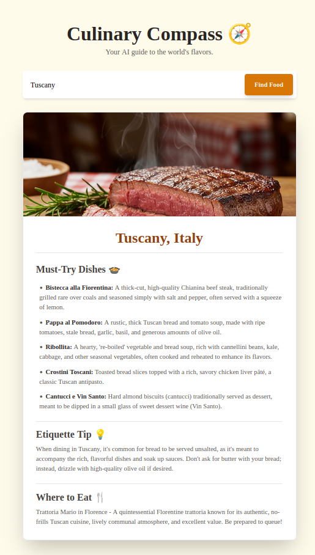

# 🧭 Culinary Compass - Your AI Food & Travel Guide

## Screenshot


**[➡️ Live Demo Link Here]** <!-- We will fill this in after deployment! -->

An intelligent web application that serves as a personal guide to the world's culinary landscape. Powered by Google's Gemini and Imagen 3 AI models, users can enter any city or country and instantly receive a curated food guide, complete with an AI-generated image of a signature dish.

A screenshot showing a culinary guide for a location, including must-try dishes and an AI-generated image.

## ✨ Features

* AI-Powered Culinary Guides: Get instant, detailed food guides for any location on Earth.

* Must-Try Dishes: Discover 3-5 essential local dishes with enticing descriptions.

* Cultural Insights: Learn a unique local food etiquette tip to dine like a local.

* Authentic Recommendations: Receive a suggestion for the type of restaurant to visit for a truly authentic experience.

* AI-Generated Imagery: A stunning, photorealistic image of the most iconic local dish is generated on the fly using Imagen 3, bringing the food to life.

* Fully Responsive Design: A beautiful, clean, and adaptive UI that looks great on any device, from mobile phones to desktops.

## 🛠️ Tech Stack

* Frontend: React, Vite

* Styling: Tailwind CSS

* Generative AI:

* Text & Logic: Google Gemini API (for structured JSON generation)

* Image Generation: Google Imagen 3 API

* Deployment: GitHub Pages

## 🚀 Setup & Installation

To run this project locally, follow these steps:

1. Clone the repository:

```sh
git clone [https://github.com/claytoncrispim/culinary-compass.git](https://github.com/claytoncrispim/culinary-compass.git)
    
cd culinary-compass
```
2. Install dependencies:
```sh
npm install
```
3. Set up environment variables:

* Create a file named .env.local in the root of the project.

* Add your Google Gemini API key to this file:
```sh
VITE_GEMINI_API_KEY=your_api_key_goes_here
```
4. Run the development server:
```sh
npm run dev
```
