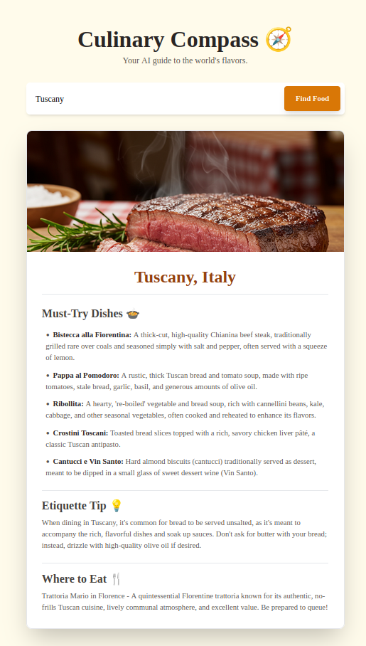

# 🧭 Culinary Compass - Your AI Food & Travel Guide


**[➡️ Live Demo Link Here](https://claytoncrispim.github.io/culinary-compass/)**

An intelligent web application that serves as a personal guide to the world's culinary landscape. Powered by Google's Gemini and Imagen 3 AI models, users can enter any city or country and instantly receive a curated food guide, complete with an AI-generated image of a signature dish.

## 📷 Screenshot



## ✨ Features

* AI-Powered Culinary Guides: Get instant, detailed food guides for any location on Earth.

* Must-Try Dishes: Discover 3-5 essential local dishes with enticing descriptions.

* Cultural Insights: Learn a unique local food etiquette tip to dine like a local.

* Authentic Recommendations: Receive a suggestion for the type of restaurant to visit for a truly authentic experience.

* AI-Generated Imagery: A stunning, photorealistic image of the most iconic local dish is generated on the fly using Imagen 3, bringing the food to life.

* Fully Responsive Design: A beautiful, clean, and adaptive UI that looks great on any device, from mobile phones to desktops.

## 🛠️ Tech Stack

* Frontend: React, Vite

* Styling: Tailwind CSS

* Backend: Node.js, Express

* Generative AI:

    * Text & Logic: Google Gemini API (for structured JSON generation)

    * Image Generation: Google Imagen 3 API

* Deployment: GitHub Pages

## 🚀 Setup & Installation

To run this project locally, follow these steps:

1. Clone the repository:

```sh
git clone https://github.com/claytoncrispim/culinary-compass.git
```
```sh    
cd culinary-compass
```
2. Install backend dependencies:
```sh
cd backend
npm install
```
3. Create backend environment variables in `backend/.env`:

```env
PORT=5000
GOOGLE_API_KEY=your_gemini_api_key
```

4. Configure credentials for Imagen 3 (choose one):

* **Local development:** place your GCP service account file at `backend/service-account.json`.
* **Hosted/production:** set `GOOGLE_SERVICE_ACCOUNT_JSON` with the full JSON string.

5. Start the backend server:

```sh
npm run dev
```

6. In a new terminal, install frontend dependencies:

```sh
cd ../frontend
npm install
```

7. Create frontend environment variables in `frontend/.env.local`:

```env
VITE_API_BASE_URL=http://localhost:5000
```

8. Start the frontend app:

```sh
npm run dev
```

9. Open the app URL shown by Vite (usually `http://localhost:5173`).


## 🔌 API Endpoints (Backend)

* `GET /api/health` — simple health check.
* `POST /api/get-guide` — returns structured culinary guide JSON from Gemini.
* `POST /api/generate-image` — returns Imagen prediction payload with base64 image data.


## 🧪 Build & Deploy

Frontend scripts (run inside `frontend/`):

```sh
npm run dev
npm run build
npm run preview
npm run deploy
```

Backend scripts (run inside `backend/`):

```sh
npm run dev
npm start
```

